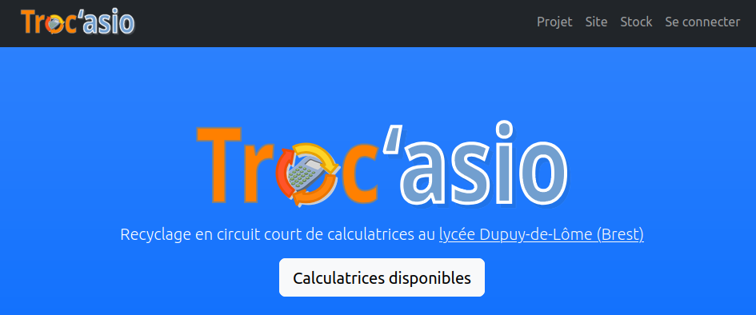
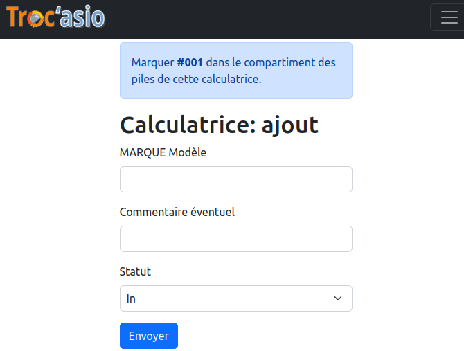

# TrocAsio

A [Symfony](https://symfony.com/) website allowing us to manage a high school stock of graphic calculators.

You can view an instance of TrocAsio [there](https://trocasio.eif-services.eu/).

## License

TrocAsio is provided under the GPLv3.

## Installation

Apart from standard Symphony procedure (e.g. [this step-by-step guide](https://medium.com/@lubna.altungi/deploying-a-symfony-application-on-apache2-a-step-by-step-guide-to-production-d79223576d52) or [that one](https://www.slingacademy.com/article/deploy-symfony-app-to-ubuntu-server/)), there is a trick with the installation of TrocAsio:

one needs to _temporarily_ comment out the `#[IsGranted('ROLE_ADMIN')]` annotation in order to create the first (and probably unique) super user.

## User interface

* Roles: 
    - ROLE_USER allows adding and editing (i) calculators, (ii) accouting entries and (iii) maintenance operations;
    - ROLE_ADMIN is there to create and edit other users;
    - an authenticated user without a role cannot do more than an anonymous visitor.

* No deletion form: the database calculator `id` is stamped on the physical one and should not be used again; thus one needs to set the calculator status `Removed`, if need be.

## Caveats

* The site is not translated yet (French only).
* When navigating back to the front page, reloading it (Ctrl-R) is currently necessary to recover the menu highlight feature when scrolling down.
